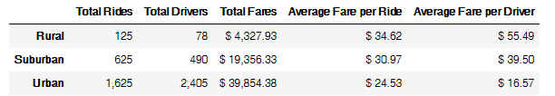
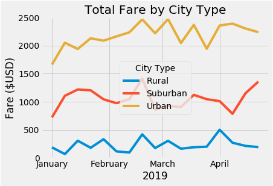

# PyBer_Analysis 
# Challenge

Purpose & Analysis
--

The purpose of this assignment was to perform exploratory data on PyBer data to explain relationships between the type of cities and the number of drivers, riders and fare values. I created a summary DataFrame grouping data by city type and I calculated values including total fares, average fare per ride, and average fare per driver to clearly display trends and present the data in a more manageable view. I also created a multiple line graph to visually display the data and further highlight these trends. 
Taking a look at the summary, there are more total rides and total drivers as you move from Rural to Urban city types and total fares increases accordingly. Average fare per rider and driver decreases as you move from Rural to Urban city types because in Rural areas there are fewer drivers and people generally take longer trips as destinations are further apart and in Urban areas, there are more drivers and destinations are closer together. 

Taking a look at the graph, all City Types have a spike in Fare in the middle of February. This spike may land on Valentine’s Day and be caused by people going out to restaurants and bars and not wanting to have to drive so they opt for a ride-sharing service. The total fare varies by each city type with none of the city types having the same total fare as another for any given date. Rural has total fare of $500 or below for any given week. Suburban ranges from around $750 to $1,500 and Urban ranges from about $1,500 to $2,500. 

Challenges
--
My biggest challenge was knowing the correct order of the methods I was using. As I was working on this assignment, I used documentation from different sources to guide my learning and found I could group methods explained from different sources but never found in what order to put them in so it ran correctly. 
To overcome this challenge, I used trial and error by adding the methods at different parts of my code. 

Recommendation & Further Analysis
--

I recommend launching ride share carpooling in Urban areas as the rides seem a lot shorter based on their average fare per ride and Urban areas tend to be denser with more riders taking similar routes at similar times. This can increase the fare for each individual driver and ride while lowering the fare for each rider by providing a more affordable service to an untapped market. 
A dataset with distance traveled on each ride would be a great addition to this research. It would be able to solidify my idea that people take shorter rides moving from Rural to Urban city types. This would help the CEO understand customer behaviours. 
The average number of rides by time of day would be an interesting analyses to run which would highlight when the most people are looking for a ride share and will help the CEO allocate more drivers to these higher-volume times. 
For distance traveled on each ride, I would create an average by city type and add it to my summary DataFrame.
For average number of rides by time of day, I would use binning to create groups of the data in buckets of “Morning Commute”, “Mid-Day”, “Afternoon Commute”, “Evening”, and “Late Night”. This would highlight at what times of the day more drivers should be allocated. 

